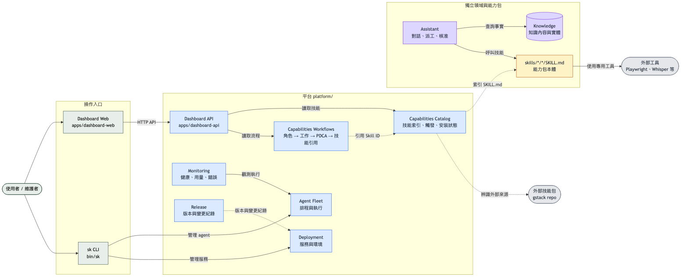
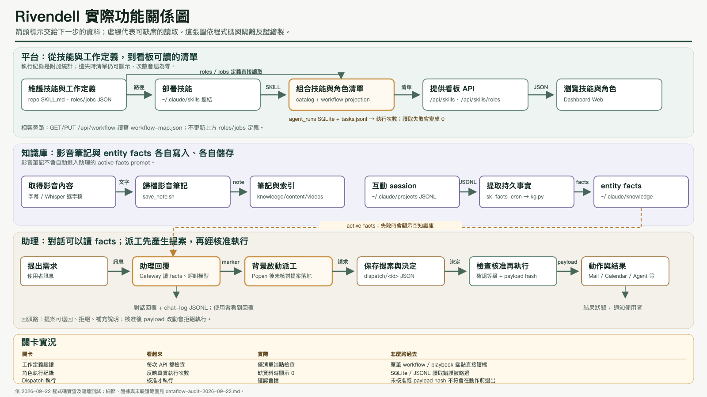
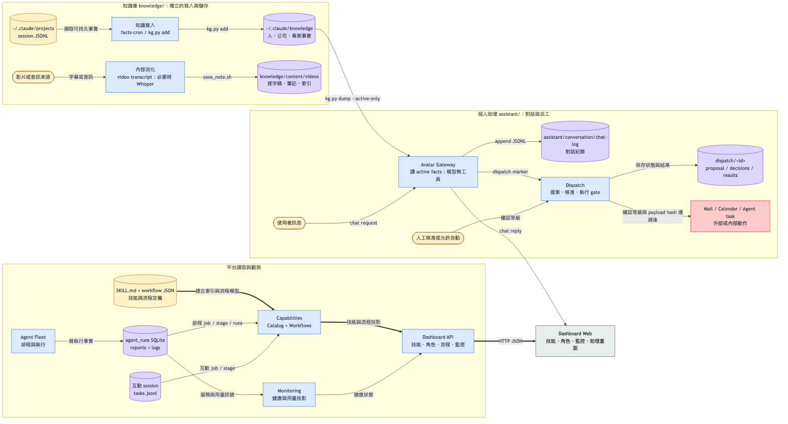
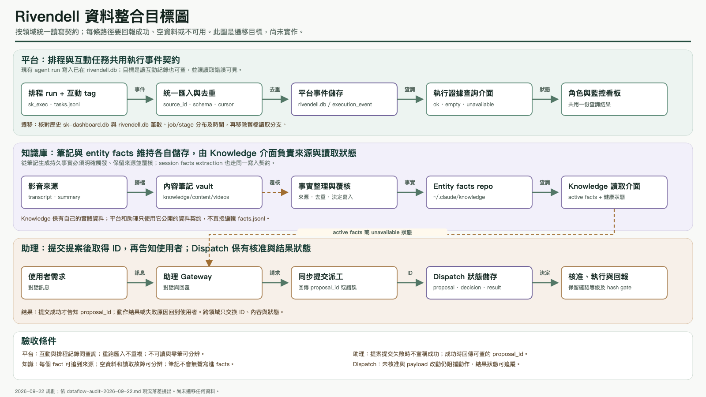
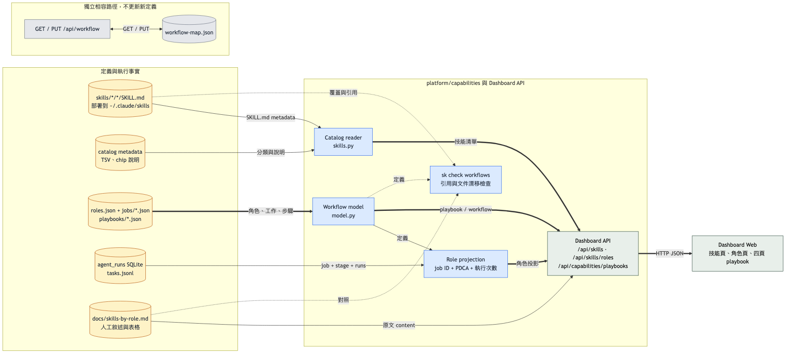

# Repository layout

The physical folders follow the owner of each rule or piece of data. Web, API, and CLI code call these modules through stable entry points.

## System architecture



The main read path is Dashboard Web → API → workflow definitions → skill catalog → `SKILL.md`. Solid arrows show runtime calls; dotted arrows show references or indirect control paths. Assistant and Knowledge are separate domains. Deployment, Release, Monitoring, and Agent Fleet are separate platform modules. The [Mermaid source](../assets/diagrams/rivendell-system-architecture.mmd) can be edited with the architecture.

## System data flow

The QA-checked [actual function map](../verification/dataflow-functions-2026-09.html) is the current reference for data handoffs and gates:



The [dataflow index](../verification/INDEX.md) links the store map, writer/reader evidence, isolated probes, and the separate consolidation target. The current system uses separate stores by domain. New scheduled runs write one `rivendell.db`; interactive session tags stay in JSONL. Knowledge notes and entity facts are separate stores; Dispatch state is stored under `dispatch/<id>`.

### Earlier overview



The [earlier system data flow source](../assets/diagrams/rivendell-system-data-flow.mmd) is a high-level overview of three domain paths. The QA check found two important limits to its arrows: failed telemetry reads become zero counts, and the assistant gateway starts proposal creation in the background without confirming that a proposal was saved. The verified map and [audit](../verification/dataflow-audit-2026-09-22.md) show those states explicitly. `video-transcript` archives notes under `knowledge/content/videos/`; `sk-facts-cron` extracts durable facts from Claude Code session JSONL into the separate `~/.claude/knowledge/` repo. The assistant prompt reads active entity facts, not video notes. Dispatch checks approval, confirmation level, and payload hash before executing an action.

### Consolidation target



This [target diagram](../verification/dataflow-stores-target-2026-09.html) describes planned contracts, not deployed behavior: one platform execution-evidence query, a Knowledge read/write interface, and a proposal submission that returns an ID or an error. Each domain keeps ownership of its data.

Deployment and release are control data paths:

| Source | Owner and destination |
|---|---|
| `docker-compose.yml`, `profiles/` | `platform/deployment/` reads service configuration and starts or stops services. |
| `VERSION`, `CHANGELOG.md` | `platform/release/` owns version and change history policy. |
| `agent_runs`, session tags, logs, generated `reports/` | `platform/monitoring/` and workflow telemetry read runtime evidence; generated reports are not edited by the Dashboard. |

### Capability read path



The [capability data flow source](../assets/diagrams/rivendell-capabilities-data-flow.mmd) expands the first path. The old `workflow-map.json` remains a separate GET/PUT compatibility store; it does not update the canonical role, job, or playbook definitions. Dotted lines in this detail view show validation inputs, while thick lines show the main read projection.

## Folder layout

```text
rivendell/
├── apps/
│   ├── dashboard-web/         Next.js UI
│   ├── dashboard-api/         FastAPI backend
│   │   ├── server.py          App assembly and startup
│   │   └── routes/            Agent, project, skill, workflow, monitoring APIs
│   ├── avatar-gateway/        Assistant channel adapter
│   └── dashboard-legacy/      Streamlit UI and shared dashboard library
├── platform/
│   ├── agent_fleet/           Agent registry, parser, management, runner source
│   ├── deployment/            Compose Dockerfiles, profiles, ports, service commands
│   │   └── cli.sh             Profile, up/down, environment, update commands
│   ├── monitoring/            Health, disk, usage, and service status
│   │   └── cli.sh             Cross-service status command
│   ├── projects/              Project data and synchronization
│   ├── release/               Release policy; canonical files still at root
│   ├── capabilities/
│   │   ├── catalog/           Hook, routing, and skill catalog metadata
│   │   └── workflows/         Role/job definitions, playbooks, and legacy map
│   ├── skill_catalog -> capabilities/catalog
│   └── workflows -> capabilities/workflows
├── assistant/
│   ├── conversation/          Chat log
│   ├── dispatch/              Proposal and decision state machine
│   ├── personas/              Persona configuration and prompts
│   └── channels/              Mail and calendar adapters
├── knowledge/
│   ├── content/videos/        Notes, transcripts, index, subscriptions
│   └── entities/kg.py        Entity knowledge API; store in ~/.claude/knowledge/
├── skills/                   Canonical ability packages
├── bin/                      Stable CLI and scheduler commands
├── scripts/                  Compatibility entry points and remaining adapters
├── docs/                     Design, mockups, and archived plans
├── data/                     Compatibility paths for moved configuration
├── dispatch/                 Live proposal data, owned by sk dispatch
├── reports/                  Generated reports, owned by scheduled agents
└── VERSION, CHANGELOG.md, ROADMAP.md, docker-compose.yml
```

`dashboard-next`, `dashboard`, `gateway`, `agents`, and `dockerfiles` at the root are compatibility links. `profiles/` and `data/` contain links for old consumers. `apps/dashboard-web/api` points to the separate `apps/dashboard-api` folder for the existing API start script. The old `scripts/` paths for knowledge, dispatch, mail, and calendar, plus `bin/sk-projects-sync` and `bin/sk-disk-snapshot`, remain stable entry paths that point to their owners.

The API keeps its route modules in `apps/dashboard-api/routes/`; `server.py` assembles the app. Monitoring has health, disk, errors, Git, issues, and token usage subroutes. Agent, project, skill catalog, deployment, workflow, collaboration, and harvest routes have their own modules. Capability definitions live in `platform/capabilities/workflows/definitions/` and the four UI playbooks in `playbooks/`. The legacy `workflow-map.json` stays writable only for `/api/workflow` compatibility and is not a source for the new workflow API. The API still imports through `apps/dashboard-legacy/lib` links. Shared SQLite access still lives in the legacy library. `bin/sk` sources deployment and service status commands from their owning modules; other commands still share the main file. Release files, dispatch data, and generated reports retain their existing storage paths until their producers and consumers can move together.

`platform/` is a filesystem boundary, not a Python package name: importing it as `platform` would collide with Python's standard library module. Extracted Python implementations need a distinct import package name.

Ability packages stay under `skills/<category>/<name>/SKILL.md`. A script used only by one package stays with that package. Shared tools go to their owning module. External tools such as Playwright and Whisper are dependencies of the packages that use them.

The role document keeps its human-written explanation and is checked against the structured definitions. The dashboard role API and four playbook pages read the capability definitions. See [the consolidation plan](../plans/2026-09-22-capabilities-workflows-consolidation.md).
