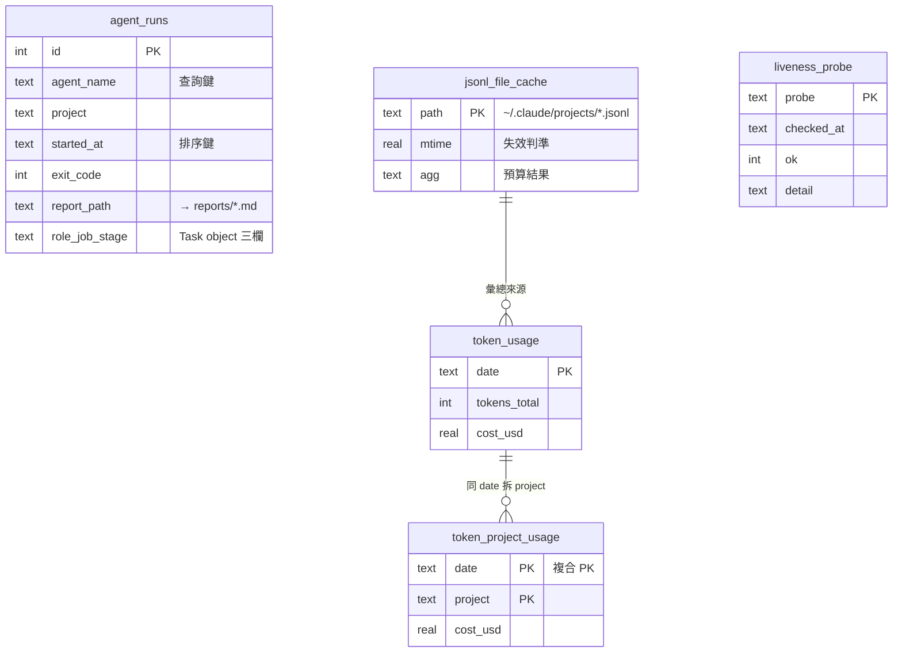
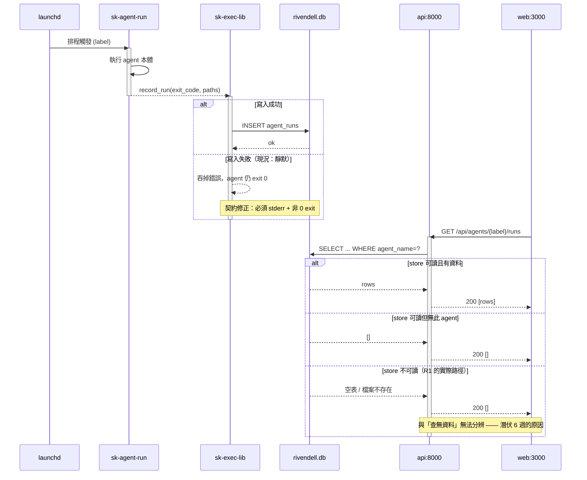
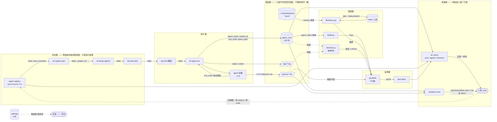

# SA/SD：rivendell 可觀測性資料層

- **日期**：2026-09-18
- **檔位**：**Full**
- **檔位判準**：三條全中——動到資料寫入（`agent_runs` 換 DB 檔）、跨模組傳遞（executor → store → API → web）、新增 store（活性檢查的狀態落點）。與 `qa-dataflow` HARD GATE 同一組判準。
- **起因**：2026-09-17 夜間連續撞到三個「安靜的失敗」，形狀完全相同——寫入端演進了、讀取端留在原地，而失敗表現為一個看起來合理的錯誤數字，不是錯誤。

---

## §1 Scope

**一句話摘要**：把「agent 跑了什麼、花了多少、結果如何」這條資料鏈收斂成單一 store、單一讀取路徑，並讓「讀不到」變成會叫的失敗而不是 0。

| In scope | Out of scope |
|---|---|
| `agent_runs` 的產生、落點、讀取 | skills 部署（`sk deploy` symlink 鏈） |
| token 用量三表（`token_usage` / `token_project_usage` / `jsonl_file_cache`） | `dispatch/*` 狀態機 |
| `agents/registry/*.md` → launchd → 執行 的 SSOT 鏈 | `gateway`、docker compose profiles |
| `sk check` 的活性層（新增） | 前端版面與互動 |
| `reports/*.md` 作為 agent 產出落點 | knowledge/ 內容庫 |

**對映的 root cause**（三條，皆 2026-09-17/18 實查）：

| # | root cause | 證據 |
|---|---|---|
| R1 | `agent_runs` 寫入 `sk-dashboard.db`、讀取 `rivendell.db`，同資料夾不同檔名 | `bin/sk-exec-lib:751` vs `dashboard/lib/db.py:6`；讀取端 0 列、寫入端 233 列 |
| R2 | `sk-registry-gen` 因系統 `python3` 無 PyYAML 而失敗，錯誤被 `2>/dev/null` 吞掉後回退到不存在的快取檔 | `bin/sk:3538` 舊版；`sk check ssot` 報 19 drift、`agents` 報 13 drift，皆為假 |
| R3 | `next start` 服務預建 `.next`，陳舊偵測只在服務啟動時跑 | `.next/.build-complete` 停在 2026-08-21，36 個來源檔比它新 |

R1、R2 已於 `910f4ba` 修復並驗證。**R3 已重建，但防止再發生的機制尚未建立——那是本 SD 的 §7 主體。**

---

## §2 資料模型

### 現況（實查來源：`sqlite3 dashboard/data/rivendell.db .schema`，2026-09-18）

單一 SQLite 檔 `dashboard/data/rivendell.db`（WAL 模式），五張表：

| 表 | 列數 | 寫入端 | 讀取端 | 狀態 |
|---|---:|---|---|---|
| `agent_runs` | 233 | `bin/sk-exec-lib` | `dashboard/lib/db.py` → API | 活 |
| `token_usage` | 27 | `dashboard/lib/tokens.py:194` (upsert by `date`) | `lib/tokens.py` → API | 活 |
| `token_project_usage` | 68 | `lib/tokens.py:236` | `lib/tokens.py` → API | 活 |
| `jsonl_file_cache` | 44 | `lib/tokens.py:671` (upsert by `path`) | `lib/tokens.py` | 活（快取） |
| `settings` | 0 | **無** | **無** | **死表** |

`sqlite_sequence` 為 SQLite 內建，不計。

### Delta

```
~ agent_runs        DB 檔從 sk-dashboard.db 改為 rivendell.db（已執行，233 列已遷移）
+ agent_runs.role   TEXT, nullable   寫：sk-exec-lib --role   讀：lib/roles.py
+ agent_runs.job    TEXT, nullable   寫：sk-exec-lib --job    讀：lib/roles.py
+ agent_runs.stage  TEXT, nullable   寫：sk-exec-lib --stage  讀：lib/roles.py
- settings          待決：刪除或啟用（見 §8 Q1）
+ liveness_probe    新表（見下）
```

**`liveness_probe`（新增，§7 反證關卡的落點）**

| 欄位 | 型別 | 可 null | 說明 |
|---|---|---|---|
| `probe` | TEXT PK | 否 | 探針名（`agent_runs_readable` / `build_fresh` / `registry_readable`） |
| `checked_at` | TEXT | 否 | ISO8601 |
| `ok` | INTEGER | 否 | 0/1 |
| `detail` | TEXT | 是 | 失敗時的實際錯誤字串，成功時 null |

- **誰寫**：`sk check liveness`（每次執行 upsert）
- **誰讀**：`/api/health`、`workflow-retro`
- **預設值**：無；不存在該列 = 從未探測過，與 `ok=0` 是不同語意
- **索引**：不需要（≤ 10 列）
- **遷移**：`CREATE TABLE IF NOT EXISTS`，無 backfill，可直接 drop 回滾

**現有索引：`agent_runs` 沒有任何索引。** 查詢模式是 `WHERE agent_name=? ORDER BY started_at DESC`。233 列下全表掃描無感，**刻意不加**——列數當證據（§7）。超過 ~50k 列再加 `(agent_name, started_at DESC)`。

### ER 圖



`agent_runs` 與 token 三表**沒有外鍵關係**——它們是兩條獨立的資料鏈，共用一個檔案而已。畫在一起是因為同一個 store，不是因為同一個領域。

---

## §3 模組職責邊界

| 模組 | 負責 | **不負責** | 依賴 |
|---|---|---|---|
| `bin/sk-agent-run` | 啟動一次 agent 執行、設定環境 | **不記錄結果**（那是 `sk-exec-lib`） | launchd |
| `bin/sk-exec-lib` | 把一次執行寫成 `agent_runs` 一列 | **不判斷成功與否的語意**（只存 exit_code）；**不寫 reports/** | rivendell.db |
| `bin/sk-registry-gen` | 由 `agents/registry/*.md` 產生 agents.conf 格式 | **不安裝 plist**（那是 `sk-setup-agents`）；**不判斷 drift** | PyYAML |
| `bin/sk-setup-agents` | registry → launchd plist | **不產生 registry**；**不執行 agent** | registry, launchctl |
| `dashboard/lib/db.py` | `agent_runs` 的連線與查詢 | **不碰 token 三表**（那是 `tokens.py` 自己的路徑） | rivendell.db |
| `dashboard/lib/tokens.py` | 由 JSONL 算 token、快取、寫三表 | **不讀 `agent_runs`** | rivendell.db, ~/.claude/projects |
| `dashboard/lib/roles.py` | 角色 × PDCA 彙總（跨 agent_runs + tasks.jsonl） | **不寫任何表**（唯讀旁掛） | 兩個來源 |
| `dashboard-next/api/server.py` | 39 個 HTTP 端點、序列化 | **不含業務邏輯**（都在 `dashboard/lib/*`）；**不寫 DB** | lib/* |
| `dashboard-next` (web) | 呈現 | **不直接讀 DB**，一律經 API | api:8000 |
| `bin/sk check` | 對帳：宣稱 vs 實際 | **不修復**（只報告 + exit code） | 全部 |
| `bin/sk-watchdog` | 服務存活重啟 | **不管服務內容是否新鮮**（R3 的缺口） | launchctl |

**邊界爭議的裁判**：`sk-exec-lib` 不負責判斷語意——這是為什麼 `today_cost` 顯示 0.0 卻不算說謊（`cost_usd` 欄位確實沒人寫）。要改的是**新增一個寫入端**，不是讓讀取端去猜。

---

## §4 介面契約

### 4.1 `GET /api/agents/{agent_label}/runs`

- **輸入**：`agent_label` path（`com.sk.agent.<project>.<name>`，取最後一段當 `agent_name`）、`limit` query（預設 10）
- **前置條件**：無（不需要先呼叫任何端點）
- **成功輸出**：`[{started_at, finished_at, exit_code, tokens_used, cost_usd, commit_sha, files_changed, qa_passed, branch_name, pr_url}]`
- **錯誤形狀（現況缺口）**：目前**查無資料與資料庫不可讀都回 `[]`**，呼叫端無法分辨。這正是 R1 能潛伏六週的原因。
  **契約修正**：DB 不可讀 → `503 {"error":"store_unreadable","detail":"<sqlite error>"}`；查無此 agent → `200 []`。
- **冪等性**：唯讀，天然冪等

### 4.2 `POST`/記錄一次執行（`sk-exec-lib` 內部函式）

- **輸入**：`project, agent_name, start_epoch, end_epoch, exit_code, structured_file, commit_sha?, files_changed?, qa_passed?, branch_name?, pr_url?`
- **輸出**：無（副作用寫一列）
- **錯誤形狀**：sqlite 寫入失敗目前**靜默**。**契約修正**：寫入失敗必須 stderr 輸出並讓 agent 的 exit code 非 0——「執行成功但沒記錄到」不可以看起來像成功。
- **冪等性**：**不冪等**。同一次執行重跑會插入第二列（無唯一鍵）。可接受（重試本來就是兩次執行），但 §8 Q2 記錄此假設。

### 4.3 `sk check liveness`（新增）

- **輸入**：`--json` / `--quiet`
- **輸出**：每個探針一列 `{probe, ok, detail}`；`--quiet` 只在有 `ok=0` 時輸出
- **錯誤形狀**：探針本身無法執行（例如 API 沒起來）→ `ok=0` + `detail` 寫明「無法探測」，**不是**略過該探針
- **冪等性**：冪等（upsert by `probe`）
- **exit code**：任一探針 `ok=0` → 1

---

## §5 關鍵流程：一次 agent 執行的記錄與讀出

只畫會出錯的那條。`alt` 分支是 R1 的實際失敗路徑。



---

## §6 功能關係圖（target）

節點是**功能**，邊是**傳遞的識別碼或資料形狀**。依 `qa-dataflow/references/diagram-spec.md` 同一規格，畫 target。



**這張圖要 argue 的**：`agent_runs` 有**一個**寫入端和**三個**讀取端（`db.py`、`roles.py`、`sk check`、`workflow-retro`），所以寫入端換檔名是單點、讀取端全部要跟——R1 就是只改了一半的相反情況。

**帶的入口標「不是什麼」**：
- 宣告層帶進來的只有**排程意圖**（label / entry / schedule）——**執行結果不隨行**，所以 `sk check agents` 只能回答「該跑的有沒有被載入」，**不能**回答「跑得好不好」。後者只有 `agent_runs` 知道。
- 落點層三個落點性質不同：`agent_runs` 是結構化狀態、`reports/*.md` 是人讀的產出、`logs/` 是除錯用尾巴。**把它們當成同一種「輸出」是錯的**——只有第一個能被查詢。

**回頭路**：`RETRO → HUMAN → REG/code` 這條是虛線且**是目前唯一沒有閘門的一條**——見 §7。

**旁掛**：`lib/roles.py` 唯讀讀兩個來源（`agent_runs` + `session-logs/tasks.jsonl`），不寫入。

---

## §7 NFR 與反證關卡

### 量級（用列數推回過度設計）

| 指標 | 實測 | 結論 |
|---|---|---|
| `agent_runs` 列數 | 233（約 4 個月） | 年增 ~700 列。**SQLite 完全夠**，2026-06 架構文件決議的 PostgreSQL 在此量級無法用列數辯護 |
| 併發寫入者 | 13 支排程 agent，錯開觸發，實測無重疊 | WAL 足夠，不需要連線池 |
| 併發讀取者 | 1（API），單使用者 | 不需要 read replica |
| 單次請求資料量 | `limit` 預設 10 列 | 不需要分頁 |

**推論**：PostgreSQL 的決議應該**撤回或重新辯護**（§8 Q3）。閒置的 PG container 是純營運成本。

### 失敗模式

| 依賴掛掉 | 現況 | target |
|---|---|---|
| rivendell.db 不可讀 | API 回 `[]`，前端顯示「無紀錄」 | 503 + `store_unreadable` |
| PyYAML 缺席 | （已修）check 報 unreadable 並 exit 1 | 維持 |
| `.next` 陳舊 | 服務正常、內容舊、無任何訊號 | liveness 探針轉紅 |
| API 未啟動 | web 端顯示空資料 | liveness 探針 `ok=0` + detail |

### 反證關卡（三態）

| 關卡 | 圖上看起來 | 實際 | 怎麼被跨過去 |
|---|---|---|---|
| `sk check` frontmatter 閘門 | ✓ 有防護 | **✓** 負向測試過（連字號 → RED + 點名） | 無 |
| `sk check` registry 可讀性 | ✓ 有防護 | **✓** 2026-09-18 負向測試過（venv python 指向不存在 → exit 1，text + json 兩模式） | 無 |
| storyline / dataflow hook 閘門 | ✓ 有防護 | **◐ 只做一半** | 有 `SK_SKIP_*` 與 `.–gate-off` 逃生門；且只在檔案存在時觸發，無 storyline 的專案不擋 |
| `sk-watchdog` | ✓ 有防護 | **◐ 只做一半** | 只看**進程活著**，不看**內容新鮮**。R3 整整一個月它每次都回報健康 |
| `agent_runs` 寫入失敗 | ✓ 有防護 | **✗ 無防護** | 錯誤被吞，agent 照樣 exit 0。「執行成功但沒記錄到」與成功無法分辨 |
| retro action 未執行 | ✓ 有防護 | **✗ 無防護** | 產出是一個 markdown 檔。不執行沒有任何代價，實測連續 6 週 0/9 執行 |
| `/runs` 回 `[]` | ✓ 有防護 | **✗ 無防護** | 「查無資料」與「store 不可讀」共用同一個回應 |

**`✗` 三條就是本 SD 要補的全部。** `◐` 兩條登記但本次不動（watchdog 的新鮮度檢查併入 liveness 探針）。

### 新增探針（`sk check liveness`）

| 探針 | 斷言 | 擋得住 |
|---|---|---|
| `agent_runs_readable` | `/api/agents/<任一 label>/runs` 回傳非空，且最新一列在 48h 內 | R1 |
| `build_fresh` | `.next/.build-complete` 不比 `src/` `public/` `next.config.ts` `package.json` 任一檔舊 | R3 |
| `registry_readable` | `sk-registry-gen generate` exit 0 且輸出非空 | R2 |

三個探針對應三個 root cause，**每一個都是先有失敗才有探針**，不是憑空想像的檢查項。

---

## §8 未決事項

| # | 問題 | 目前假設 | 誰能拍板 | 什麼時候必須決定 |
|---|---|---|---|---|
| Q1 | `settings` 表 0 列無讀寫端，刪還是啟用？ | 假設是 `init_db()` 建了沒人用的殘留 | Peter | 下次動 schema 時 |
| Q2 | `agent_runs` 無唯一鍵，同次執行重試會產生兩列——可接受嗎？ | 假設可接受（重試本來就是兩次執行） | Peter | 若要算「成功率」時必須先決定 |
| Q3 | 2026-06 決議的 PostgreSQL 要撤回還是續行？ | 假設撤回（列數不支持） | Peter | 該文件的「2 個月右尺寸檢查點」已於 2026-08 到期，逾期中 |
| Q4 | retro action 的牙齒要多硬？（`sk check` 轉紅 vs 只警告） | 假設：超過 3 個週期未執行 → 紅 | Peter | 實作 liveness 層時一併 |
| Q5 | `cost_usd` / `tokens_used` 目前全 null，誰負責寫？ | 假設由 `sk-exec-lib` 於執行後由 JSONL 回填 | Peter | `today_cost` 要有意義之前 |

---

## §9 實作偏離（2026-09-18 實作後補記）

實作過程有三處偏離本文設計，都是實作時才看見的約束，記在這裡而不是默默改掉。

| # | 設計說 | 實作做 | 為什麼 |
|---|---|---|---|
| D1 | §4.2 寫入失敗要讓 agent exit 非 0 | **只寫 stderr，回傳 0** | 呼叫端全是 `set -euo pipefail`，而 `sk-mail-triage-cron:209` 在腳本中段呼叫——回非 0 會在 Telegram 推送之前中止，丟掉真正的工作。牙齒改由 `agent_runs_readable` 探針系統性地抓 |
| D2 | §7 `agent_runs_readable` 斷言「`/runs` 回非空」 | **差分探針：先問 store 有幾列，再要求 API 同意** | 直接讀 store 在 R1 當下會**通過**——store 一直是好的，錯的是讀取端指向別處。不走 API 就抓不到讀寫分裂 |
| D3 | （未設計） | **`get_probes()` 加 36h 過期判定；`cmd_maintain` 加第 8 步** | 探針只在有人跑時更新，而全艦隊沒有任何排程跑 `sk check`。不補這兩處，`/api/health` 會永遠顯示上一次的綠燈——正是本文要修的那個病，只是上移了一層 |

**負向測試**（證明探針會叫，不是加了段不觸發的程式碼）：

| 模擬 | 結果 |
|---|---|
| API 回 `[]` 但 store 有 233 列 | `FAIL … READER/WRITER SPLIT`，exit 1 |
| API 連不上 | `FAIL … api:8000 unreachable`，exit 1 |
| sentinel 指向 2020 年的檔案 | `FAIL … 92 source file(s) newer` |
| venv python 指向不存在的執行檔 | `FAIL … ModuleNotFoundError: No module named 'yaml'` |
| 36h 前的 `ok=1` 探針 | 強制轉 `ok=0`，標 `STALE (418.5h old)` |

第二項第一次測時**沒有輸出且 exit=7**——`set -e` 在 `api_rc=$?` 之前就把腳本打死了。改用 `if !` 包住才修好。這是負向測試抓到的實作 bug，不是設計問題。

---

## 下一步

| 下一步 | Skill | 做什麼 |
|---|---|---|
| 審設計 | `/gstack-plan-eng-review` | 現在它有東西可審了 |
| 拆任務 | `/planning-with-files` | 依 §7 三個探針 + §4 兩個契約修正拆 |
| 實作後 | `/qa-dataflow` | 拿 §6 target 圖對照 actual，落差表就是這份設計被驗證或被推翻的地方 |

---

*依 2026-09-18 程式碼與資料庫實查。schema 出自 `sqlite3 dashboard/data/rivendell.db .schema`；端點清單出自 `dashboard-next/api/server.py`；列數為當日實測。*
