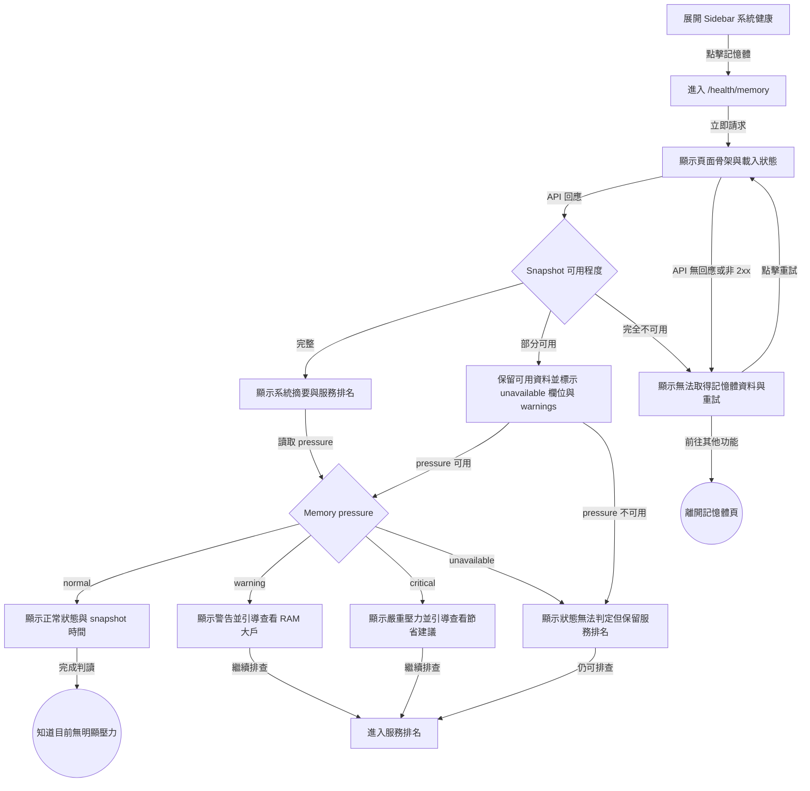
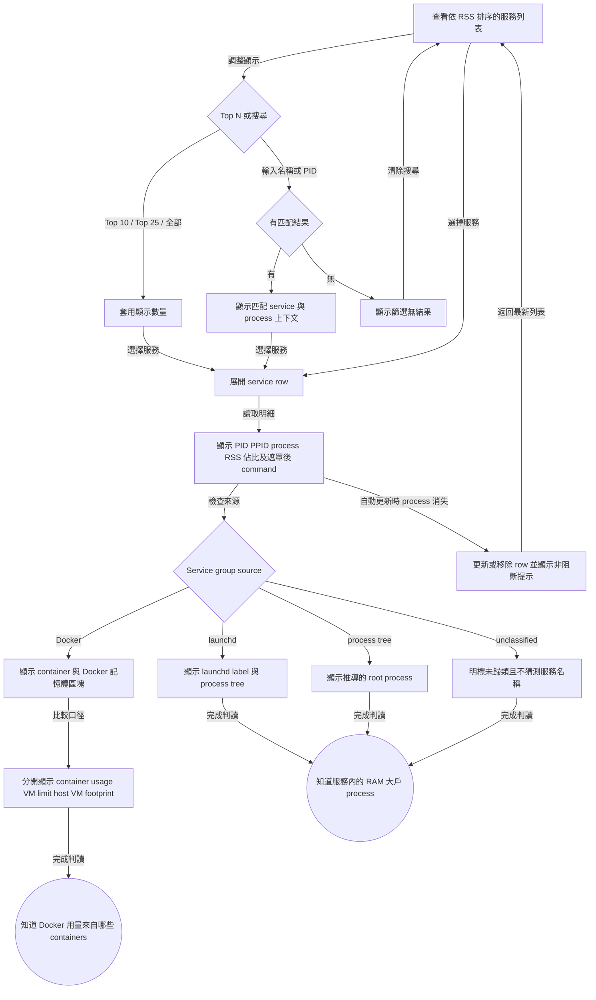
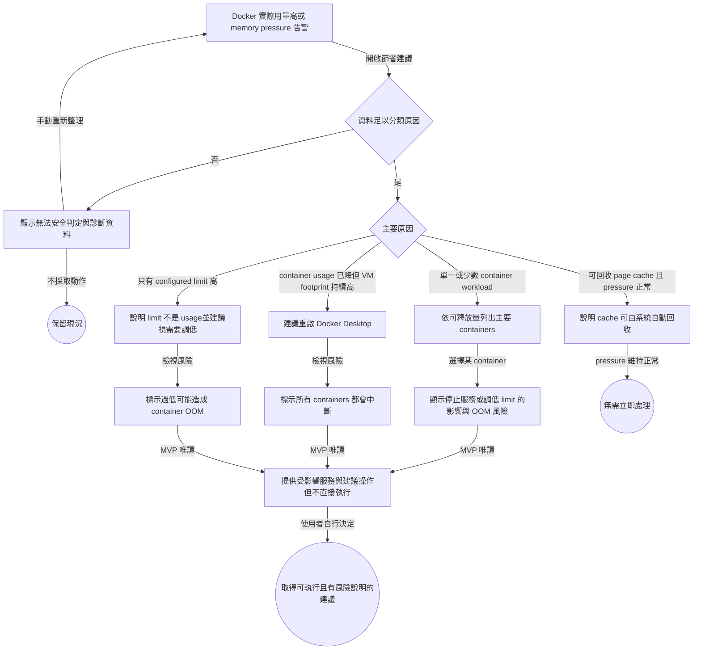
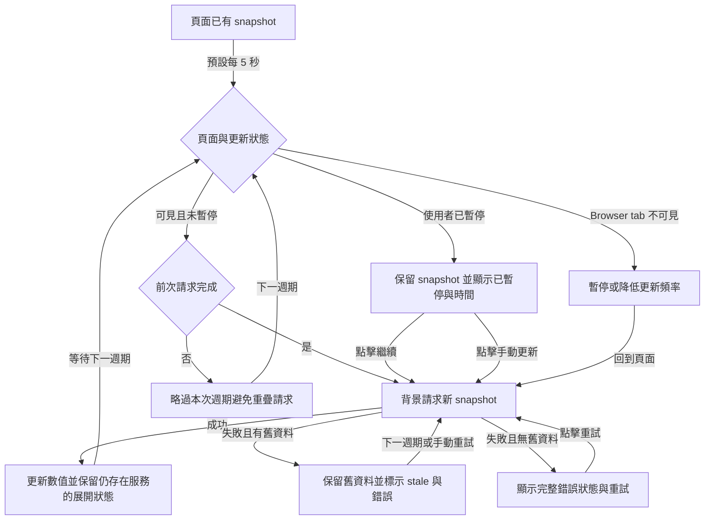

# User Flow: RAM Service Monitor

**Feature:** `ram-service-monitor`  
**Status:** draft  
**Date:** 2026-08-18  
**Route:** `/health/memory`  
**Entry:** Sidebar → 系統健康 → 記憶體  
**Source:** `docs/requirements/ram-service-monitor.md`

## Flow 1: 進入頁面並判斷是否有記憶體壓力

## Flow 2: 找出是哪個服務與 process 使用 RAM

## Flow 3: 在 Docker 使用量高時取得節省建議

## Auto-refresh 與資料新鮮度分支

## Error & Edge Cases

| 情境 | 頁面行為 | 不可發生 |
|---|---|---|
| Dashboard API 無法連線 | 完整錯誤狀態、顯示最後嘗試時間與重試 | 顯示 0 GB 或空白頁 |
| Docker daemon 無法連線 | Docker 區塊 unavailable；host service 排名維持可用 | 整頁失敗 |
| Memory pressure 指標無法取得 | 該欄位 unavailable；不自行用 used % 猜狀態 | 誤標 normal |
| 單一 PID 在取樣中消失 | 忽略或標示已結束並加入 warning | 整次 snapshot 500 |
| Command 含 secret | API server 先遮罩再回傳 | Secret 曾送達 browser |
| Service 無法可靠歸屬 | 顯示 unclassified / process tree source | 猜成 launchd 或 Docker service |
| RSS 合計與 system used 不一致 | 顯示口徑說明 | 把差額標為 bug 或可回收量 |
| Docker limit 高但 usage 低 | 顯示為設定上限，不告警 | 稱為 Docker 已使用 RAM |
| Snapshot 更新後服務消失 | 移除 row、保留其他展開狀態並提示 | React error 或整表清空 |
| 使用者在閱讀時列表跳動 | 可暫停；展開狀態保持 | 強制每次回到列表頂部 |

## Screen / State Inventory

| # | Screen / State | Purpose | Key Elements |
|---|---|---|---|
| 1 | Sidebar — 系統健康展開 | 進入功能 | 記憶體 nav item、active state |
| 2 | 記憶體 — 初次載入 | 等待第一個 snapshot | Page title、summary skeleton、list skeleton |
| 3 | 記憶體 — 正常 live | 判斷系統狀態與 RAM 大戶 | Pressure、physical RAM、swap、sample time、auto-refresh control、service rank |
| 4 | 記憶體 — warning / critical | 強調需要排查 | Semantic status、主要大戶、節省建議入口 |
| 5 | 記憶體 — service 展開 | 查看 process 明細 | PID、PPID、name、RSS、percentage、redacted command、group source |
| 6 | 記憶體 — Docker 詳情 | 區分 Docker 三種口徑 | Container usage、configured VM limit、host VM footprint、container rank |
| 7 | 記憶體 — 節省建議 | 決定怎麼降低用量 | 原因、證據、estimated reclaimable、風險、受影響服務、唯讀建議 |
| 8 | 記憶體 — paused | 固定 snapshot 供閱讀 | 已暫停標籤、sample time、繼續、手動更新 |
| 9 | 記憶體 — stale | 保留舊資料並說明更新失敗 | 舊資料、stale label、錯誤摘要、重試 |
| 10 | 記憶體 — partial data | 部分資料源失敗仍可診斷 | Available sections、field-level unavailable、warnings |
| 11 | 記憶體 — full error | 沒有可用 snapshot | Error reason、last attempt、retry |
| 12 | 記憶體 — filter empty | 區分無匹配與無 process | Search term、clear-filter action |

## Wireframe Constraints

- 系統摘要與 memory pressure 必須先於 service ranking，先回答「是否有壓力」。
- Docker 的 `usage / limit` 不使用單一進度條暗示 limit 已被配置或保留；label 必須完整。
- 節省建議中的 risk 與 estimated reclaimable 必須同時出現，沒有估算依據時顯示 unknown。
- 頁面更新不得重置搜尋、Top N、pause 或仍存在 service 的展開狀態。
- MVP 所有 remediation controls 都是說明或複製指令入口，不是直接執行按鈕。

