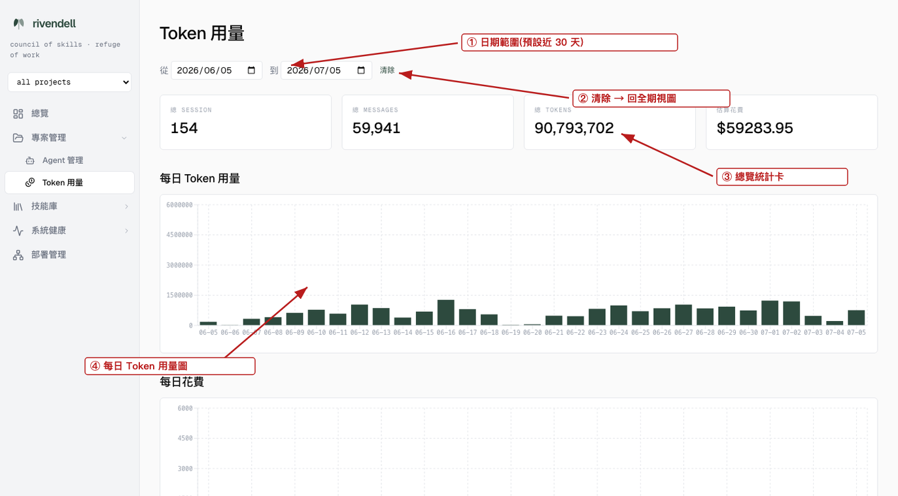
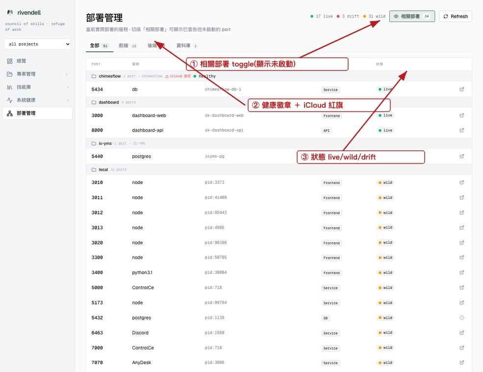
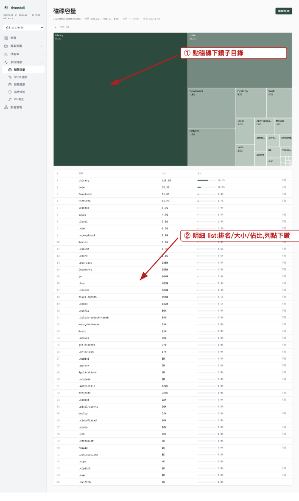

# Rivendell Dashboard 操作手冊

> 產生方式:QA 走查同步撰寫(2026-07-05)。每張圖為當日實際畫面 + 箭頭標註;
> 同一趟走查的 UX/破圖檢查結果在 `.gstack/qa-reports/qa-report-dashboard-2026-07-05.md`。
> 入口:`http://localhost:3000`(web)/ API `:8000`(經 `/api/*` 同源 proxy)。

## 頁面總覽

| 頁 | 路徑 | 用途 |
|---|------|------|
| 總覽 | `/` | 系統健康、專案、Agent/Hook 狀態、Pending issues 一頁看 |
| Token 用量 | `/tokens` | 花費趨勢(預設近 30 天)+ 模型/專案分解 |
| 部署管理 | `/ports` | 誰在跑、哪個 port、來源資料夾、健康 |
| Skill 總覽 | `/skills` | 技能庫 104+ skills 目錄與觸發 |
| Agent 管理 | `/agents` | 排程 agent 狀態/日誌/啟停 |
| 磁碟容量 | `/health/disk` | treemap + 明細 list,找出磁碟大戶 |

---

## Token 用量(`/tokens`)

1. **日期範圍**:預設帶入**近 30 天**(避免全歷史擠成一排)。改任一日期即重新查詢。
2. **清除**:一鍵清空日期 → 回**全期**視圖(所有歷史)。
3. **總覽統計卡**:所選區間的 sessions / messages / tokens / 估算花費。
4. **每日 Token 用量 / 每日花費**:長條圖,滑過看單日數值。
5. 往下捲:**模型用量**(各模型 tokens/費用)與**專案用量**(已收斂到頂層 repo,不會出現 `xxx/apps/web` 子資料夾)。
6. 「這些錢做了什麼」→ 看每晚 23:45 自動產出的 `reports/token-analysis-*.md` 或 Telegram 日報;歷史明細在 SQLite `token_project_usage` 表。

## 部署管理(`/ports`)

1. **相關部署 toggle**:預設只列**當前部署**(live);打開顯示「宣告了但沒在跑」(drift/declared-only)與「在跑但沒宣告」(wild)。
2. **專案群組列**:每組顯示來源資料夾(hover 看全路徑)、**健康徽章**(真的 curl 過 health endpoint)與 **iCloud 路徑紅旗**(容器還跑在舊 `~/Documents/Projects` 該重建)。
3. **狀態欄**:`live`(跑著)/ `wild`(未宣告)/ `drift`(宣告未跑)。列點擊/外連圖示可直接開 `localhost:<port>`。
4. Port 規矩見 `docs/port-allocation.md`:**3=前端、8=後端、5=資料庫**,每產品一個 NN。

## 磁碟容量(`/health/disk`)

1. **Treemap**:面積=佔用。**點磁磚下鑽**子目錄;上方 breadcrumb 返回。
2. **明細 list**(treemap 下方):所有子目錄的排名/大小/佔比 bar——treemap 上讀不到的小目錄在這裡都有字;**列點擊同樣下鑽**。
3. **重新整理**(右上):觸發重新掃描(大目錄需時間,平常看快照即可)。

## 其他頁快速說明

- **總覽 `/`**:首次載入約 5-8 秒(聚合多個資料源),看到「載入中…」屬正常。
- **Agent 管理 `/agents`**:每張卡=一個排程 agent(含每晚 token-analysis / token-snapshot),可看最近執行、日誌、手動觸發。
- **Skill 總覽 `/skills`**:技能卡片 + 分類;點卡看 TRIGGER/SKIP。
